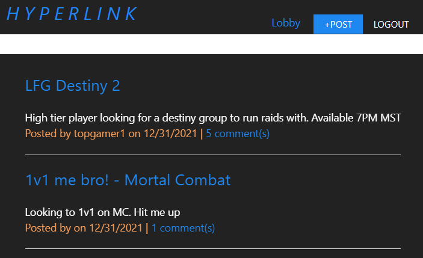

## Hyper Link
---

### Description
Hyperlink is a web app used to connect gamers! By signing up, a user can post on a our forum, and search for other like minded players. Whether you need to find a 5th for a group, or simply want a ranked gameplay partner, Hyperlink can help.

### Usage

In order to use the app, the user will first need to register an account. Once registered, they can begin posting and commenting into the lobby. The lobby will show all posts made to the site. 

#### *Post Dashboard*
By clicking the "+Post" button at the top, the user is taken to a posting dashboard. Here, they will see their username on the left, a post form in the middle, and site metrics for what's most popular based on number of posts. When ready, a post can be made by entering a title, text, and selecting a specific game. From there, the post will be uploaded to the lobby for all to see.  

#### *Editing Posts*
Within the posts form, the user can view all of their previous posts under the "Your Posts" section. Here, by selecting "Edit post" link, the user can update the title, post body or simply delete the entire post entirely. 

### Link
To open the app, click on the following: [Hyperlink](https://hyperlink-app.herokuapp.com/). Happy browsing!
